Mini Data Analysis Milestone 2
================
Sasha Tuttle

Fill in the sections that are commented out with
`<!--- start your work here--->`. When you are done, make sure to knit
to an `.md` file by changing the output in the YAML header to
`github_document`, before submitting a tagged release on canvas.

**NOTE**: The main purpose of the mini data analysis is to integrate
what you learn in class in an analysis. Although each milestone provides
a framework for you to conduct your analysis, it’s possible that you
might find the instructions too rigid for your data set. If this is the
case, you may deviate from the instructions – just make sure you’re
demonstrating a wide range of tools and techniques taught in this class.

Begin by loading your data and the tidyverse package below:

``` r
Pilot<-read.csv("C:/Users/stutt/OneDrive/Desktop/Greenhouse_study/Pilot_study.csv", 
  header=T) 
suppressPackageStartupMessages(library(tidyverse))
```

# Learning Objectives

By the end of this milestone, you should:

-   Become familiar with manipulating and summarizing your data in
    tibbles using `dplyr` and `tidyr`, with a research question in mind.
-   Understand what *tidy* data is, and how to create it. In milestone
    3, we will explore when this might be useful.
-   Generate a reproducible and clear report using R Markdown.
-   Gain a greater understanding of how to use R to answer research
    questions about your data.

**Things to keep in mind**

-   Remember to document your code, be explicit about what you are
    doing, and write notes in this markdown document when you feel that
    context is required. Create your analysis as if someone else will be
    reading it! **There will be 2.5 points reserved for reproducibility,
    readability, and repo organization.**

-   Before working on each task, you should always keep in mind the
    specific **research question** that you’re trying to answer.

# Task 1: Process and summarize your data (15 points)

From milestone 1, you should have an idea of the basic structure of your
dataset (e.g. number of rows and columns, class types, etc.). Here, we
will start investigating your data more in-depth using various data
manipulation functions.

### 1.1 (2.5 points)

First, write out the 4 research questions you defined in milestone 1
were. This will guide your work through milestone 2:

<!-------------------------- Start your work below ---------------------------->

1.  Do blueberry flowers of the bluecrop variety experience a greater
    fruit set when they receive pollen from another blueberry variety?

2.  Do heavier berries have a higher TSS? a lower pH/TA?

3.  Does stem diameter have an effect on blueberry weight?

4.  Does the Bluecrop variety experience greater benefits from receiving
    pollen from another variety relative to the Duke variety?
    <!----------------------------------------------------------------------------->

### 1.2 (10 points)

Now, for each of your four research questions, choose one task from
options 1-4 (summarizing), and one other task from 4-8 (graphing). You
should have 2 tasks done for each research question (8 total). Make sure
it makes sense to do them! (e.g. don’t use a numerical variables for a
task that needs a categorical variable.). Comment on why each task helps
(or doesn’t!) answer the corresponding research question.

Ensure that the output of each operation is printed!

**Summarizing:**

1.  Compute the *range*, *mean*, and *two other summary statistics* of
    **one numerical variable** across the groups of **one categorical
    variable** from your data.
2.  Compute the number of observations for at least one of your
    categorical variables. Do not use the function `table()`!
3.  Create a categorical variable with 3 or more groups from an existing
    numerical variable. You can use this new variable in the other
    tasks! *An example: age in years into “child, teen, adult, senior”.*
4.  Based on two categorical variables, calculate two summary statistics
    of your choosing.

**Graphing:**

5.  Create a graph out of summarized variables that has at least two
    geom layers.
6.  Create a graph of your choosing, make one of the axes logarithmic,
    and format the axes labels so that they are “pretty” or easier to
    read.
7.  Make a graph where it makes sense to customize the alpha
    transparency.
8.  Create 3 histograms out of summarized variables, with each histogram
    having different sized bins. Pick the “best” one and explain why it
    is the best.

Make sure it’s clear what research question you are doing each operation
for!

<!------------------------- Start your work below ----------------------------->

First, I need to clean up my data and separate the varieties like I did
in Milestone 1.

``` r
head(Pilot)
```

    ##   Plant_num Cluster_ID  Variety Pollen_donor num_buds end_num_buds num_berries
    ## 1         1          1 Bluecrop     Bluecrop       68           68          42
    ## 2         1          2 Bluecrop         Duke       89           81          74
    ## 3         1          3 Bluecrop         Reka       62           52          52
    ## 4         1          4 Bluecrop     Bluecrop       76           76          59
    ## 5         1          5 Bluecrop         Duke       84           83          55
    ## 6         1          6 Bluecrop         Reka      102          102          81
    ##   fruit_set berry_weight stem_diam Average_TSS Average_pH Volume       TA
    ## 1 0.6176471        16.09      5.96       20.00     2.8557   6.00 25600.00
    ## 2 0.9135802        33.35      4.15       20.10     2.8197   5.99 25557.33
    ## 3 1.0000000        23.45      6.53       21.40     2.8850   6.20 26453.33
    ## 4 0.7763158        15.49      6.67       19.47     2.8260   5.89 25130.67
    ## 5 0.6626506        22.94      4.73       19.13     2.7690   6.44 27477.33
    ## 6 0.7941176        32.40      7.20       20.30     2.9130   5.81 24789.33
    ##   TA.true.
    ## 1 25.60000
    ## 2 25.55733
    ## 3 26.45333
    ## 4 25.13067
    ## 5 27.47733
    ## 6 24.78933

``` r
#Some of the columns aren't necessary as they were only used for calculations.
#Other columns were simply used for sample IDs or have poor choice of names.

Data<-as_tibble(Pilot) %>%
select(Variety, Pollen_donor, berry_weight, fruit_set,
Average_TSS, Average_pH, TA.true.) %>%
arrange(Pollen_donor, desc(fruit_set)) %>%
rename(Berry_weight_g = berry_weight) %>%
rename(TSS = Average_TSS) %>%
rename(pH = Average_pH) %>%
rename(Titratable_acid = TA.true.)


Blue_B<- as_tibble(Data) %>%
filter(Variety == "Bluecrop") %>%
filter(Pollen_donor =="Bluecrop")


Blue_D<- as_tibble(Data) %>%
filter(Variety == "Bluecrop") %>%
filter(Pollen_donor =="Duke") 


Blue_R<- as_tibble(Data) %>%
filter(Variety == "Bluecrop") %>%
filter(Pollen_donor =="Reka") 
```

Blue_B organizes the data into the self-pollinated Bluecrop treatment
(meaning Bluecrop flowers that received pollen from another Bluecrop
variety).

Blue_D organizes the data into Bluecrop variety flowers that received
pollen from the Duke variety (an out-cross treatment).

Blue_R Blue_D organizes the data into Bluecrop variety flowers that
received pollen from the Reka variety (an out-cross treatment).

**Exploring Research question 1** **Summarizing the data (task 1)**

``` r
summary(Data$fruit_set)
```

    ##    Min. 1st Qu.  Median    Mean 3rd Qu.    Max. 
    ##  0.0000  0.1615  0.4599  0.4230  0.6182  1.0000

``` r
#alternatively, you can use the following functions:
mean(Data$fruit_set)
```

    ## [1] 0.4230136

``` r
median(Data$fruit_set)
```

    ## [1] 0.4599359

``` r
range(Data$fruit_set)
```

    ## [1] 0 1

These functions have given me the summary statistics for all of the
treatments though! I am interested in comparing the mean and median
between treatments.

``` r
summary(Blue_B$fruit_set)
```

    ##    Min. 1st Qu.  Median    Mean 3rd Qu.    Max. 
    ##  0.4154  0.4591  0.4661  0.5333  0.5809  0.7763

``` r
summary(Blue_D$fruit_set)
```

    ##    Min. 1st Qu.  Median    Mean 3rd Qu.    Max. 
    ##  0.3590  0.5654  0.6395  0.6336  0.6920  0.9136

``` r
summary(Blue_R$fruit_set)
```

    ##    Min. 1st Qu.  Median    Mean 3rd Qu.    Max. 
    ##  0.5114  0.6277  0.6754  0.7127  0.7706  1.0000

**Graph the summarized variables (Task 5)**

``` r
Blue<-as_tibble(Data) %>%
  filter(Variety == "Bluecrop")

ggplot(Blue, aes(Pollen_donor, fruit_set)) + geom_boxplot() + 
    geom_jitter(width=0.1, alpha=0.5) + xlab("pollen donor") + ylab("fruit set (%)") +
    ggtitle("Fruit Set vs Pollen Donor in the Bluecrop variety")
```

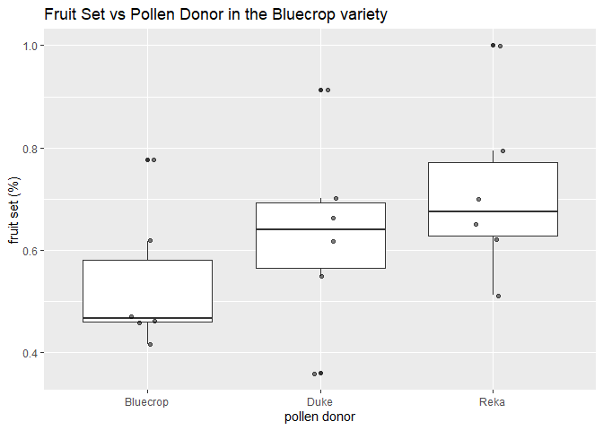<!-- -->

The box plot above illustrates the minimum value, median, maximum value,
as well as the 1st and 3rd quartiles.The figures suggests that the
self-crossed Bluecrop treatments experienced a smaller fruit set
relative to those that received pollen from another variety. I would
have to use an anova to see if this difference is statistically
significant though.

**Exploring Research question 2**

I am interested to see if heavier blueberries have a higher % total
soluble solids (TSS) and/or a lower pH because these variables relate to
blueberry quality. TSS correlates with sugar content in blueberries, so
a large blueberry with a high TSS and low pH would be sweet and
considered to be high quality. Alternatively, larger berries could have
a lower TSS (%) as the sugar becomes diluted. I’m interested to see if
cross-pollination increases blueberry weight in Bluecrop but decreases
TSS as a trade off (affecting the sugar:acid ratio). But I hope to see
an increase in overall blueberry quality as a result of increased
genetic diversity (so, an increase in berry weight and TSS, and a
decrease in pH and TA).

**Summarizing the data**

It doesn’t help me to find the summary statistics of the berry weight or
the other variables so instead I’ll create a tibble to see if I can see
any trends when organizing the data.

``` r
Data1<-as_tibble(Pilot) %>%
filter(Variety == "Bluecrop") %>%
select(Variety, Pollen_donor, berry_weight, Average_TSS, Average_pH, TA.true.) %>%
arrange(Variety, Pollen_donor, desc(berry_weight), Average_TSS) %>%
rename(Berry_weight_g = berry_weight) %>%
rename(TSS = Average_TSS) %>%
rename(pH = Average_pH) %>%
rename(Titratable_acid = TA.true.)

head(Data1, n=36)
```

    ## # A tibble: 18 x 6
    ##    Variety  Pollen_donor Berry_weight_g   TSS    pH Titratable_acid
    ##    <chr>    <chr>                 <dbl> <dbl> <dbl>           <dbl>
    ##  1 Bluecrop Bluecrop              16.1   20    2.86           25.6 
    ##  2 Bluecrop Bluecrop              15.5   19.5  2.83           25.1 
    ##  3 Bluecrop Bluecrop              10.3   19.7  3.04           11.0 
    ##  4 Bluecrop Bluecrop               9.21  17.0  2.74           22.2 
    ##  5 Bluecrop Bluecrop               8.28  18.3  2.78           23.4 
    ##  6 Bluecrop Bluecrop               8.27  17.3  2.83           19.8 
    ##  7 Bluecrop Duke                  33.4   20.1  2.82           25.6 
    ##  8 Bluecrop Duke                  28.2   17.5  3.06           13.6 
    ##  9 Bluecrop Duke                  23.8   19.2  2.83           22.3 
    ## 10 Bluecrop Duke                  22.9   19.1  2.77           27.5 
    ## 11 Bluecrop Duke                  18.1   21.2  3.13           15.8 
    ## 12 Bluecrop Duke                   6.51  18.1  2.80           15.7 
    ## 13 Bluecrop Reka                  42.8   17.8  3.20            8.96
    ## 14 Bluecrop Reka                  32.4   20.3  2.91           24.8 
    ## 15 Bluecrop Reka                  27.0   19.6  2.99           17.1 
    ## 16 Bluecrop Reka                  25.2   19.1  2.94           17.4 
    ## 17 Bluecrop Reka                  23.4   21.4  2.88           26.5 
    ## 18 Bluecrop Reka                  20.6   19.9  3.40            7.85

Organizing the data like so, it does seem like heavier berries may have
a higher TSS in the control treatment (Bluecrop x Bluecrop) but the
trend isn’t as apparent in the other treatments. Potential trends in the
pH aren’t as apparent either. I’ll create one scatter plot of berry
weight against TSS and one with berry weight against pH to see if these
trends follow a positive linear relationship.

**Graph the data (Task 7)**

I decided the best way to start to answer the second research question
is by creating a scatter plot. I first want to test if there is a
positive linear relationship between berry weight and TSS in the
combined data. Then I will test the Bluecrop variety alone to see if
cross-pollination affects this relationship. I’ll do the same with berry
weight vs pH and berry weight vs TSS, but I suspect that there will be a
negative linear relationship in both cases.

``` r
#Testing berry weight against TSS using the combined data
ggplot(Data, aes(Berry_weight_g, TSS)) +
  geom_point(size=3, alpha=0.8) + 
  xlab("Berry weight (g)") + ylab("TSS (%)") + 
  ggtitle("Scatterplot of Blueberry Weight (g) vs TSS (%)")
```

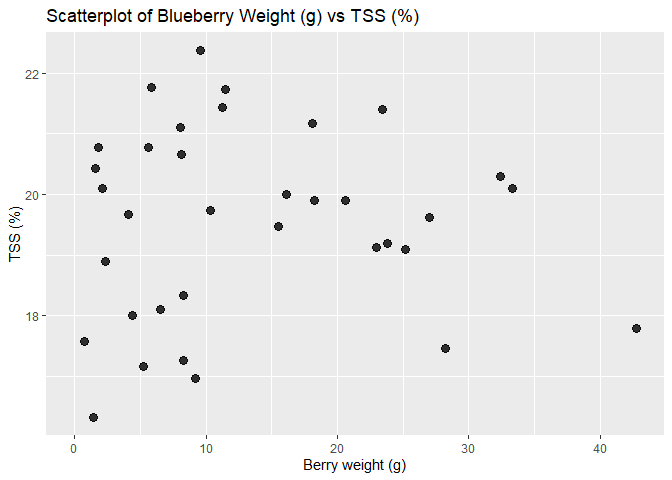<!-- -->

``` r
#Testing berry weight against TSS using just the Bluecrop variety
ggplot(Data1, aes(Berry_weight_g, TSS)) + facet_wrap(~Pollen_donor) +
  geom_point(aes(color = Pollen_donor),
  size=3, alpha=0.8) + xlab("Berry weight (g)") + ylab("TSS (%)")
```

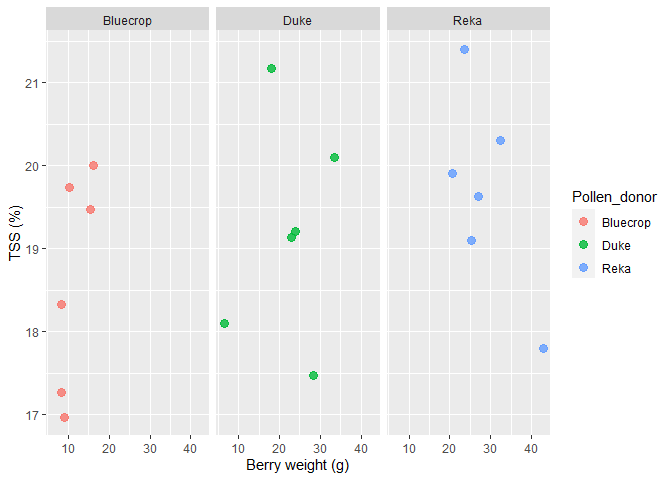<!-- -->

When combining the data, it seems like a positive linear relationship
may exist between these two variables. However, there’s no way to know
for sure without trying to fit the data to a linear model and using
regression statistics. The relationship is harder to see when separating
the data into the different treatments.

``` r
#Testing berry weight against pH using the combined data
ggplot(Data, aes(pH, Berry_weight_g)) +
  geom_point(size=3, alpha=0.8) + 
  ylab("Berry weight (g)") + 
  ggtitle("Scatterplot of Blueberry Weight (g) vs pH")
```

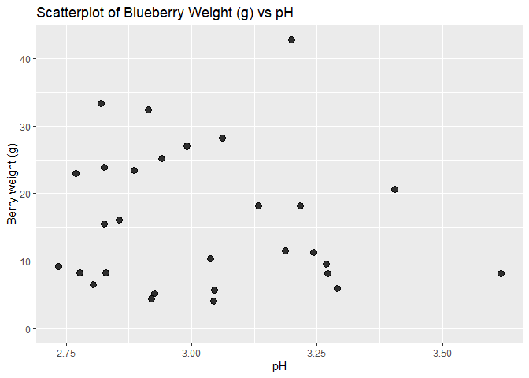<!-- -->

``` r
#Testing berry weight against pH using just the Bluecrop variety
ggplot(Data1, aes(pH, Berry_weight_g)) + facet_wrap(~Pollen_donor) +
  geom_point(aes(color = Pollen_donor), 
  size=3, alpha=0.8) + ylab("Berry weight (g)") 
```

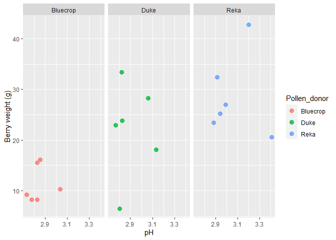<!-- -->

Unlike the previous set of figures, it is harder to see a trend in the
data, even before separating the data into the different treatments. I
would still try fitting the data to a linear model via regression to be
sure.

``` r
#Testing berry weight against TA using the combined data
ggplot(Data, aes(Titratable_acid, Berry_weight_g)) +
  geom_point(size=3, alpha=0.8) + 
  ylab("Berry weight (g)") + xlab("Titratable acid (TA)") +
  ggtitle("Scatterplot of Blueberry Weight (g) vs Titratable acid (TA)")
```

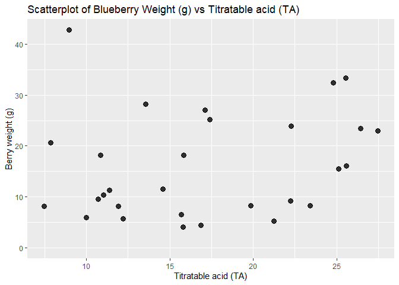<!-- -->

``` r
#Testing berry weight against TA using just the Bluecrop variety
ggplot(Data1, aes(Titratable_acid, Berry_weight_g)) + facet_wrap(~Pollen_donor) +
  geom_point(aes(color = Pollen_donor), 
  size=3, alpha=0.8) + ylab("Berry weight (g)") + xlab("Titratable acid (TA)")
```

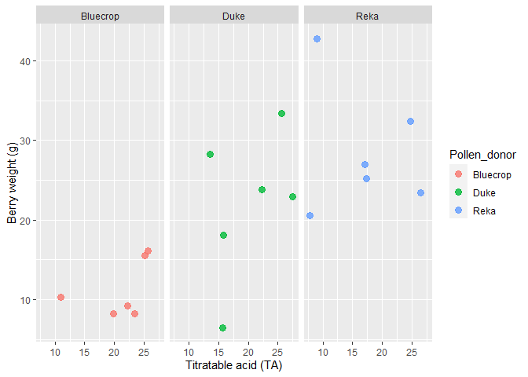<!-- -->

Similar to the previous set of scatterplots, it’s difficult to see a
trend. Again, I’d like to try fitting the data to a linear model.

**Research question 3**

I suspect that stem diameter may have an effect on berry weight because
thicker stems should carry more water and nutrients, and hold more
leaves (relative to thinner stems). These attributes could yield larger
berries from the additional water and nutrients.

**summarizing the data**

This time, I need to arrange the data to see if there are any apparent
trends in the stem diameter and the berry weight columns. I also don’t
need to focus in on one variety like I did before because I’m only
interested in the possibility of stem diameter acting as a confounding
variable in my study. If I accidentally chose thicker stems in some
treatments over others, and the relationship I suspect exists, it could
affect my results!

``` r
Data2<-as_tibble(Pilot) %>%
  select(stem_diam, berry_weight) %>%
  arrange(desc(stem_diam), berry_weight) %>%
  rename(Berry_weight_g = berry_weight) %>%
  rename(Stem_diam_cm = stem_diam)
head(Data2, n=36)
```

    ## # A tibble: 36 x 2
    ##    Stem_diam_cm Berry_weight_g
    ##           <dbl>          <dbl>
    ##  1         9.03          11.5 
    ##  2         8.42           8.28
    ##  3         7.78           0.78
    ##  4         7.64           4.44
    ##  5         7.32          11.2 
    ##  6         7.2           32.4 
    ##  7         7.13          18.2 
    ##  8         7.01           1.81
    ##  9         6.67          15.5 
    ## 10         6.53          23.4 
    ## # ... with 26 more rows

There doesn’t appear to be any obvious trend organizing the data this
way. I’ll have to create a scatterplot to see if a trend becomes more
easily visible.

``` r
ggplot(Data2, aes(Stem_diam_cm, Berry_weight_g)) +
  geom_point(size=3, alpha=0.8) + xlab("Stem diameter (cm)") +
  ylab("Berry weight (g)") + ggtitle("Scatterplot of Berry weight vs Stem diameter")
```

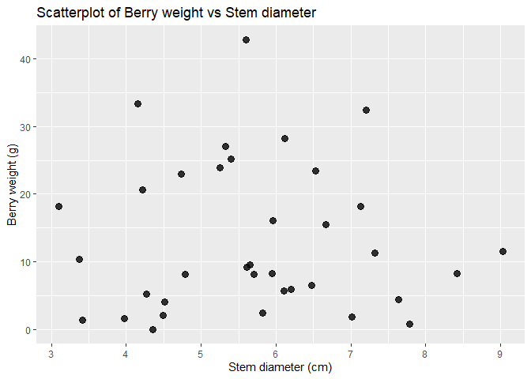<!-- -->

From the scatterplot above, it is difficult to see if there is a strong
relationship between the berry weight and stem diameter. I would have to
try fitting the data to a linear model via regression to know for sure.

**Research question 4**

To answer this question, I need to compare the TSS, pH, and TA of the
different treatments for the Bluecrop variety and for the Duke variety.
TSS positively correlates with sugar content and sweetness whereas TA
positively correlates with sourness. A higher quality berry is large,
sweet whereas a poor quality berry is typically small and sour. On the
other hand, berries with a lower pH are more sour (negative
correlation). I’ve already compared TSS between the different treatments
of the Bluecrop variety but I still need to compare the other variables.
I also need to compare the aforementioned variables for the different
treatments for the Duke variety.

**summarizing the data**

First, I’ll organize the data to focus on the three variables mentioned
before. Then I need to separate the data into the two varieties of
interest.

``` r
Data3<-as_tibble(Blue) %>%
  select(Variety, Pollen_donor, TSS, pH, Titratable_acid) %>%
  arrange(Variety, Pollen_donor, desc(TSS), pH, Titratable_acid) 

head(Data3, n=36)
```

    ## # A tibble: 18 x 5
    ##    Variety  Pollen_donor   TSS    pH Titratable_acid
    ##    <chr>    <chr>        <dbl> <dbl>           <dbl>
    ##  1 Bluecrop Bluecrop      20    2.86           25.6 
    ##  2 Bluecrop Bluecrop      19.7  3.04           11.0 
    ##  3 Bluecrop Bluecrop      19.5  2.83           25.1 
    ##  4 Bluecrop Bluecrop      18.3  2.78           23.4 
    ##  5 Bluecrop Bluecrop      17.3  2.83           19.8 
    ##  6 Bluecrop Bluecrop      17.0  2.74           22.2 
    ##  7 Bluecrop Duke          21.2  3.13           15.8 
    ##  8 Bluecrop Duke          20.1  2.82           25.6 
    ##  9 Bluecrop Duke          19.2  2.83           22.3 
    ## 10 Bluecrop Duke          19.1  2.77           27.5 
    ## 11 Bluecrop Duke          18.1  2.80           15.7 
    ## 12 Bluecrop Duke          17.5  3.06           13.6 
    ## 13 Bluecrop Reka          21.4  2.88           26.5 
    ## 14 Bluecrop Reka          20.3  2.91           24.8 
    ## 15 Bluecrop Reka          19.9  3.40            7.85
    ## 16 Bluecrop Reka          19.6  2.99           17.1 
    ## 17 Bluecrop Reka          19.1  2.94           17.4 
    ## 18 Bluecrop Reka          17.8  3.20            8.96

``` r
Data4<-as_tibble(Data) %>%
  filter(Variety == "Duke") %>%
  select(Variety, Pollen_donor, TSS, pH, Titratable_acid) %>%
  arrange(Variety, Pollen_donor, desc(TSS), pH, Titratable_acid) 

head(Data4, n=36)
```

    ## # A tibble: 18 x 5
    ##    Variety Pollen_donor   TSS    pH Titratable_acid
    ##    <chr>   <chr>        <dbl> <dbl>           <dbl>
    ##  1 Duke    Bluecrop      22.4  3.27           10.7 
    ##  2 Duke    Bluecrop      20.8  3.05           12.2 
    ##  3 Duke    Bluecrop      20.8 NA              NA   
    ##  4 Duke    Bluecrop      20.4 NA              NA   
    ##  5 Duke    Bluecrop      20.1 NA              NA   
    ##  6 Duke    Bluecrop      18    2.92           16.9 
    ##  7 Duke    Duke          20.7  3.62            7.47
    ##  8 Duke    Duke          19.7  3.04           15.8 
    ##  9 Duke    Duke          18.9 NA              NA   
    ## 10 Duke    Duke          17.2  2.93           21.2 
    ## 11 Duke    Duke          16.3 NA              NA   
    ## 12 Duke    Duke          NA   NA              NA   
    ## 13 Duke    Reka          21.8  3.29            9.98
    ## 14 Duke    Reka          21.7  3.19           14.6 
    ## 15 Duke    Reka          21.4  3.24           11.4 
    ## 16 Duke    Reka          21.1  3.27           11.9 
    ## 17 Duke    Reka          19.9  3.22           10.8 
    ## 18 Duke    Reka          17.6 NA              NA

Before graphing the data, I’ll compare the means and medians of the
different treatments to see if I can see any obvious differences.

``` r
#Comparing TSS, pH and TA in the Bluecrop variety
summary(Blue_B$TSS)
```

    ##    Min. 1st Qu.  Median    Mean 3rd Qu.    Max. 
    ##   16.97   17.54   18.90   18.63   19.66   20.00

``` r
summary(Blue_D$TSS)
```

    ##    Min. 1st Qu.  Median    Mean 3rd Qu.    Max. 
    ##   17.47   18.36   19.16   19.20   19.88   21.17

``` r
summary(Blue_R$TSS)
```

    ##    Min. 1st Qu.  Median    Mean 3rd Qu.    Max. 
    ##   17.80   19.23   19.77   19.69   20.20   21.40

``` r
summary(Blue_B$pH)
```

    ##    Min. 1st Qu.  Median    Mean 3rd Qu.    Max. 
    ##   2.735   2.789   2.828   2.843   2.849   3.037

``` r
summary(Blue_D$pH)
```

    ##    Min. 1st Qu.  Median    Mean 3rd Qu.    Max. 
    ##   2.769   2.808   2.823   2.902   3.003   3.133

``` r
summary(Blue_R$pH)
```

    ##    Min. 1st Qu.  Median    Mean 3rd Qu.    Max. 
    ##   2.885   2.920   2.966   3.055   3.147   3.405

``` r
summary(Blue_B$Titratable_acid)
```

    ##    Min. 1st Qu.  Median    Mean 3rd Qu.    Max. 
    ##   11.01   20.44   22.83   21.21   24.70   25.60

``` r
summary(Blue_D$Titratable_acid)
```

    ##    Min. 1st Qu.  Median    Mean 3rd Qu.    Max. 
    ##   13.57   15.73   19.05   20.07   24.74   27.48

``` r
summary(Blue_R$Titratable_acid)
```

    ##    Min. 1st Qu.  Median    Mean 3rd Qu.    Max. 
    ##   7.851  10.997  17.259  17.095  22.944  26.453

There doesn’t appear to be a significant difference in TSS or pH between
the treatments in the Bluecrop variety. However, there may be a
significant difference in the TA between the treatments. I have to test
this with an ANOVA to be certain.

Next, I’ll organize the data to select for the different treatments of
the Duke variety. Then I can compare the TSS, pH and TA in the Duke
variety.

``` r
Duke_D<- as_tibble(Data) %>%
filter(Variety == "Duke") %>%
filter(Pollen_donor == "Duke") 

Duke_B<- as_tibble(Data) %>%
filter(Variety == "Duke") %>%
filter(Pollen_donor =="Bluecrop")

Duke_R<- as_tibble(Data) %>%
filter(Variety == "Duke") %>%
filter(Pollen_donor =="Reka") 

#Comparing TSS, pH and TA in the Duke variety
summary(Duke_D$TSS)
```

    ##    Min. 1st Qu.  Median    Mean 3rd Qu.    Max.    NA's 
    ##   16.33   17.17   18.90   18.55   19.67   20.67       1

``` r
summary(Duke_B$TSS)
```

    ##    Min. 1st Qu.  Median    Mean 3rd Qu.    Max. 
    ##   18.00   20.18   20.60   20.41   20.77   22.37

``` r
summary(Duke_R$TSS)
```

    ##    Min. 1st Qu.  Median    Mean 3rd Qu.    Max. 
    ##   17.57   20.20   21.27   20.58   21.66   21.77

``` r
summary(Duke_D$pH)
```

    ##    Min. 1st Qu.  Median    Mean 3rd Qu.    Max.    NA's 
    ##   2.927   2.986   3.044   3.196   3.330   3.617       3

``` r
summary(Duke_B$pH)
```

    ##    Min. 1st Qu.  Median    Mean 3rd Qu.    Max.    NA's 
    ##   2.920   2.983   3.046   3.078   3.158   3.269       3

``` r
summary(Duke_R$pH)
```

    ##    Min. 1st Qu.  Median    Mean 3rd Qu.    Max.    NA's 
    ##   3.187   3.216   3.244   3.242   3.272   3.291       1

``` r
summary(Duke_D$Titratable_acid)
```

    ##    Min. 1st Qu.  Median    Mean 3rd Qu.    Max.    NA's 
    ##   7.467  11.627  15.787  14.834  18.517  21.248       3

``` r
summary(Duke_B$Titratable_acid)
```

    ##    Min. 1st Qu.  Median    Mean 3rd Qu.    Max.    NA's 
    ##   10.71   11.46   12.20   13.26   14.53   16.85       3

``` r
summary(Duke_R$Titratable_acid)
```

    ##    Min. 1st Qu.  Median    Mean 3rd Qu.    Max.    NA's 
    ##   9.984  10.837  11.392  11.742  11.904  14.592       1

There may be a significant difference between the TSS of the different
treatment groups as well as the TA but there doesn’t seem to be much
difference in the pH. I would need to investigate this further with
ANOVA to know for certain (assuming the data follows a normal
distribution).

**Graph the data**

To illustrate the data and look for signs of correlation, I need to
create boxplots to compare the TSS, pH and TA between the different
treatments of the two varieties.

``` r
ggplot(Blue, aes(Pollen_donor, TSS)) + geom_boxplot() + 
    geom_jitter(width=0.1, alpha=0.5) + xlab("pollen donor") + 
    ylab("total soluble solids (%)") +
    ggtitle("TSS vs Pollen Donor in the Bluecrop variety")
```

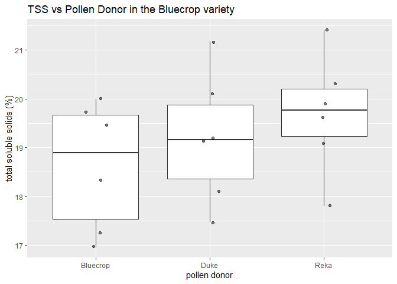<!-- -->

``` r
ggplot(Blue, aes(Pollen_donor, pH)) + geom_boxplot() + 
    geom_jitter(width=0.1, alpha=0.5) + xlab("pollen donor") + 
    ylab("pH") +
    ggtitle("pH vs Pollen Donor in the Bluecrop variety")
```

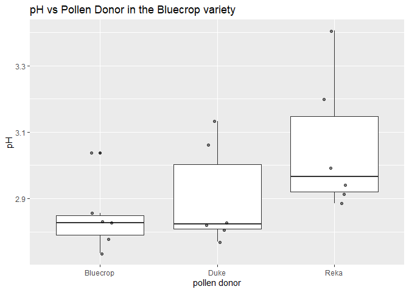<!-- -->

``` r
ggplot(Blue, aes(Pollen_donor, Titratable_acid)) + geom_boxplot() + 
    geom_jitter(width=0.1, alpha=0.5) + xlab("pollen donor") + 
    ylab("titratable acid (mg citric acid/g FW") +
    ggtitle("Titratable acid vs Pollen Donor in the Bluecrop variety")
```

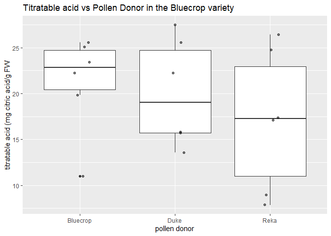<!-- -->

The boxplots help illustrate the range and medians of the data. Again,
there seems like there could be a significant difference between the TSS
and TA but there’s still no way to say for certain without using
statistics.

``` r
#Filtering the variety to Duke only 
Du<-as_tibble(Data) %>%
  filter(Variety == "Duke")

#Setting the pollen donor as a factor so I can rearrange for the control first
Du$Pollen_donor <- factor(Du$Pollen_donor, c("Duke", "Bluecrop", "Reka")) 
  
#Creating the boxplots
ggplot(Du, aes(Pollen_donor, TSS)) + geom_boxplot() + 
    geom_jitter(width=0.1, alpha=0.5) + xlab("pollen donor") + 
    ylab("total soluble solids (%)") +
    ggtitle("TSS vs Pollen Donor in the Duke variety")
```

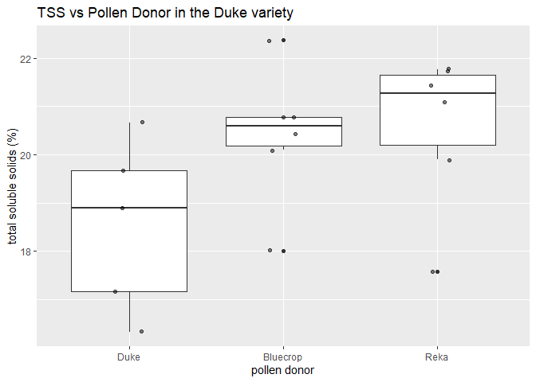<!-- -->

``` r
ggplot(Du, aes(Pollen_donor, pH)) + geom_boxplot() + 
    geom_jitter(width=0.1, alpha=0.5) + xlab("pollen donor") + 
    ylab("pH") +
    ggtitle("pH vs Pollen Donor in the Duke variety")
```

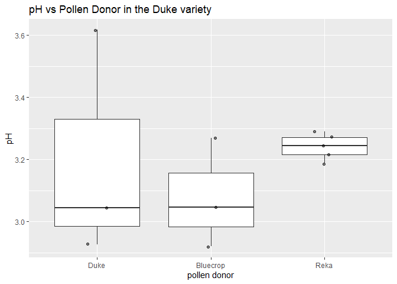<!-- -->

``` r
ggplot(Du, aes(Pollen_donor, Titratable_acid)) + geom_boxplot() + 
    geom_jitter(width=0.1, alpha=0.5) + xlab("pollen donor") + 
    ylab("titratable acid (mg citric acid/g FW") +
    ggtitle("Titratable acid vs Pollen Donor in the Duke variety")
```

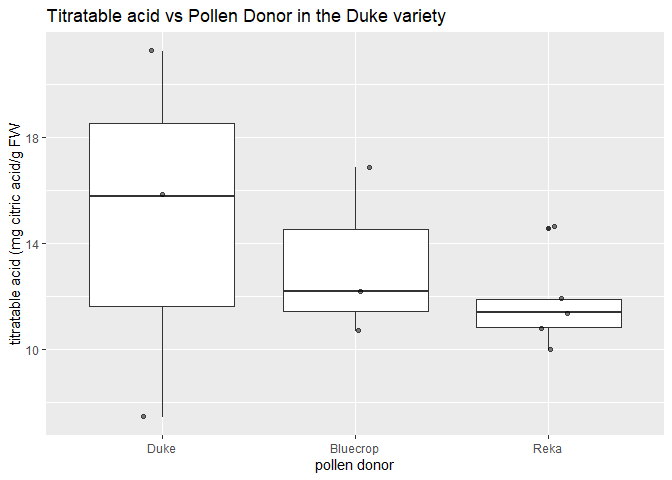<!-- -->

From the boxplots above, there seems to be greater differences between
some of these treatments relative to the Bluecrop variety treatments.
There are promising signs of a significant difference in TSS between at
least two of the treatments. There may even be a significant difference
in pH between some of the treatments. Again, I can’t tell for sure
without performing statistics. I’ll have to check the distribution of
the data to see if I can use an ANOVA test.

<!----------------------------------------------------------------------------->

### 1.3 (2.5 points)

Based on the operations that you’ve completed, how much closer are you
to answering your research questions? Think about what aspects of your
research questions remain unclear. Can your research questions be
refined, now that you’ve investigated your data a bit more? Which
research questions are yielding interesting results?

<!------------------------- Write your answer here ---------------------------->

While the figures are helpful for visualizing data and for spotting
trends, they cannot be used alone as evidence for significant
differences between population means. Below each exploration of the
research questions, I explain what types of statistics I would use.

<!----------------------------------------------------------------------------->

# Task 2: Tidy your data (12.5 points)

In this task, we will do several exercises to reshape our data. The goal
here is to understand how to do this reshaping with the `tidyr` package.

A reminder of the definition of *tidy* data:

-   Each row is an **observation**
-   Each column is a **variable**
-   Each cell is a **value**

*Tidy’ing* data is sometimes necessary because it can simplify
computation. Other times it can be nice to organize data so that it can
be easier to understand when read manually.

### 2.1 (2.5 points)

Based on the definition above, can you identify if your data is tidy or
untidy? Go through all your columns, or if you have \>8 variables, just
pick 8, and explain whether the data is untidy or tidy.

<!--------------------------- Start your work below --------------------------->

The original dataset (Pilot) is definitely untidy. The columns include
sample IDs that aren’t helpful as well as columns used for calculation
of fruit set and titratable acid. The column names are long and unwieldy
too.

Please see lines 87 through 94 for the first example of how I tidied the
data to select the columns of interest and arrange them in a sensible
order. Then I renamed some of the poorly named columns.

<!----------------------------------------------------------------------------->

### 2.2 (5 points)

Now, if your data is tidy, untidy it! Then, tidy it back to it’s
original state.

If your data is untidy, then tidy it! Then, untidy it back to it’s
original state.

Be sure to explain your reasoning for this task. Show us the “before”
and “after”.

<!--------------------------- Start your work below --------------------------->

``` r
#The first tibble I created to tidy the data
Data<-as_tibble(Pilot) %>%
  select(Variety, Pollen_donor, berry_weight, fruit_set,
  Average_TSS, Average_pH, TA.true.) %>%
  arrange(Pollen_donor, desc(fruit_set)) %>%
  rename(Berry_weight_g = berry_weight) %>%
  rename(TSS = Average_TSS) %>%
  rename(pH = Average_pH) %>%
  rename(Titratable_acid = TA.true.)

#Referring back to the original dataset to see which columns are missing from the tibble
head(Pilot)
```

    ##   Plant_num Cluster_ID  Variety Pollen_donor num_buds end_num_buds num_berries
    ## 1         1          1 Bluecrop     Bluecrop       68           68          42
    ## 2         1          2 Bluecrop         Duke       89           81          74
    ## 3         1          3 Bluecrop         Reka       62           52          52
    ## 4         1          4 Bluecrop     Bluecrop       76           76          59
    ## 5         1          5 Bluecrop         Duke       84           83          55
    ## 6         1          6 Bluecrop         Reka      102          102          81
    ##   fruit_set berry_weight stem_diam Average_TSS Average_pH Volume       TA
    ## 1 0.6176471        16.09      5.96       20.00     2.8557   6.00 25600.00
    ## 2 0.9135802        33.35      4.15       20.10     2.8197   5.99 25557.33
    ## 3 1.0000000        23.45      6.53       21.40     2.8850   6.20 26453.33
    ## 4 0.7763158        15.49      6.67       19.47     2.8260   5.89 25130.67
    ## 5 0.6626506        22.94      4.73       19.13     2.7690   6.44 27477.33
    ## 6 0.7941176        32.40      7.20       20.30     2.9130   5.81 24789.33
    ##   TA.true.
    ## 1 25.60000
    ## 2 25.55733
    ## 3 26.45333
    ## 4 25.13067
    ## 5 27.47733
    ## 6 24.78933

``` r
#Untidying the original tibble
Untidy<-as_tibble(Data) %>%
  rename(Average_TSS = TSS) %>%
  rename(Average_pH = pH) %>%
  rename(TA.true. = Titratable_acid) %>%
  arrange(Variety, Pollen_donor)

head(Untidy)
```

    ## # A tibble: 6 x 7
    ##   Variety  Pollen_donor Berry_weight_g fruit_set Average_TSS Average_pH TA.true.
    ##   <chr>    <chr>                 <dbl>     <dbl>       <dbl>      <dbl>    <dbl>
    ## 1 Bluecrop Bluecrop              15.5      0.776        19.5       2.83     25.1
    ## 2 Bluecrop Bluecrop              16.1      0.618        20         2.86     25.6
    ## 3 Bluecrop Bluecrop               8.28     0.471        18.3       2.78     23.4
    ## 4 Bluecrop Bluecrop              10.3      0.462        19.7       3.04     11.0
    ## 5 Bluecrop Bluecrop               9.21     0.458        17.0       2.74     22.2
    ## 6 Bluecrop Bluecrop               8.27     0.415        17.3       2.83     19.8

Now the “Untidy” data is as close to the original, untidy “Pilot”
dataset as I can make it (without adding back the missing columns).

<!----------------------------------------------------------------------------->

### 2.3 (5 points)

Now, you should be more familiar with your data, and also have made
progress in answering your research questions. Based on your interest,
and your analyses, pick 2 of the 4 research questions to continue your
analysis in milestone 3, and explain your decision.

Try to choose a version of your data that you think will be appropriate
to answer these 2 questions in milestone 3. Use between 4 and 8
functions that we’ve covered so far (i.e. by filtering, cleaning,
tidy’ing, dropping irrelevant columns, etc.).

<!--------------------------- Start your work below --------------------------->

For milestone 3, I’d like to pursue the first and last research
questions. These research questions focus on my primary hypotheses and
predictions rather than potential confounding variables.

As a refresher, these research questions are:

1.  Do blueberry flowers of the bluecrop variety experience a greater
    fruit set when they receive pollen from another blueberry variety?

2.  Does the Bluecrop variety experience greater benefits from receiving
    pollen from another variety relative to the Duke variety?

<!----------------------------------------------------------------------------->

*When you are done, knit an `md` file. This is what we will mark! Make
sure to open it and check that everything has knitted correctly before
submitting your tagged release.*

### Attribution

Thanks to Victor Yuan for mostly putting this together.
