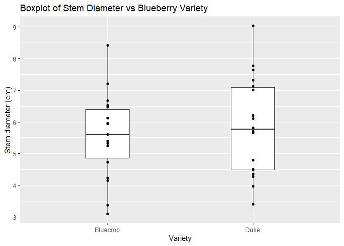
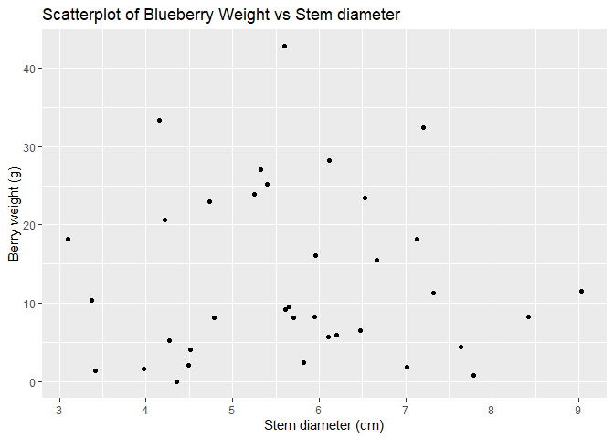

# Sasha’s Mini Data Analysis Project

Sasha Tuttle October 14, 2021

`{r setup, include=FALSE} knitr::opts_chunk$set(echo = FALSE)`

Loading packages:

``` r
#install.packages("devtools")
#devtools::install_github("UBC-MDS/datateachr")
suppressPackageStartupMessages(library(rmarkdown))
suppressPackageStartupMessages(library(devtools))
suppressPackageStartupMessages(library(datateachr))
suppressPackageStartupMessages(library(tidyverse))
suppressPackageStartupMessages(library(ggplot2))
```

Loading the pilot study data

``` r
Pilot<-read.csv("C:/Users/stutt/OneDrive/Desktop/Greenhouse_study/Pilot_study.csv", 
  header=T)
head(Pilot)
```

    ##   Plant_num Cluster_ID  Variety Pollen_donor num_buds end_num_buds num_berries
    ## 1         1          1 Bluecrop     Bluecrop       68           68          42
    ## 2         1          2 Bluecrop         Duke       89           81          74
    ## 3         1          3 Bluecrop         Reka       62           52          52
    ## 4         1          4 Bluecrop     Bluecrop       76           76          59
    ## 5         1          5 Bluecrop         Duke       84           83          55
    ## 6         1          6 Bluecrop         Reka      102          102          81
    ##   fruit_set berry_weight stem_diam Average_TSS Average_pH Volume       TA
    ## 1 0.6176471        16.09      5.96       20.00     2.8557   6.00 25600.00
    ## 2 0.9135802        33.35      4.15       20.10     2.8197   5.99 25557.33
    ## 3 1.0000000        23.45      6.53       21.40     2.8850   6.20 26453.33
    ## 4 0.7763158        15.49      6.67       19.47     2.8260   5.89 25130.67
    ## 5 0.6626506        22.94      4.73       19.13     2.7690   6.44 27477.33
    ## 6 0.7941176        32.40      7.20       20.30     2.9130   5.81 24789.33
    ##   TA.true.
    ## 1 25.60000
    ## 2 25.55733
    ## 3 26.45333
    ## 4 25.13067
    ## 5 27.47733
    ## 6 24.78933

``` r
Stem<-rename(Pilot, stem_diam_cm = stem_diam)
```

The Pilot_study.csv file contains data from a pilot study where I tested
the effects of cross-pollination on three different varieties of *V.
corymbosum* (highbush blueberry). I tested the effects of
cross-pollination with regards to fruit yield, berry weight, TSS (%),
pH, and titratable acid (TA). I hypothesized that blueberry flowers that
received pollen from a different variety would have a higher yield and
berry weight relative to flowers that received pollen from the same
variety. I also hypothesized that blueberry flowers that were
cross-pollinated would yield higher quality blueberries (high TSS, low
pH, low TA) relative to self-crossed blueberry flowers. Treatments were
assigned to different branches of the same bush, so all of the
measurements were taken for a whole cluster of berries. Note that the
units for fruit set and TSS are in percent and the units for TA are mg
citric acid/g formula weight (FW).

I am interested in the data in the columns titled: “Variety”,
“Pollen_donor”, “fruit_set”, “berry_weight”, “stem_diam”, “Average_TSS”,
“Average_pH”, and “TA.true”. The other columns are not of interest as
they were used for calculation or are simply sample IDs.

**Task 1: Investigating the datasets in the datateachr package**

``` r
dim(Pilot)
```

    ## [1] 36 15

``` r
typeof(Pilot)
```

    ## [1] "list"

``` r
class(Pilot)
```

    ## [1] "data.frame"

The pilot study dataset has 36 rows and 15 columns. It is classified as
a data frame.

``` r
#?cancer_sample
print(cancer_sample)
```

    ## # A tibble: 569 x 32
    ##          ID diagnosis radius_mean texture_mean perimeter_mean area_mean
    ##       <dbl> <chr>           <dbl>        <dbl>          <dbl>     <dbl>
    ##  1   842302 M                18.0         10.4          123.      1001 
    ##  2   842517 M                20.6         17.8          133.      1326 
    ##  3 84300903 M                19.7         21.2          130       1203 
    ##  4 84348301 M                11.4         20.4           77.6      386.
    ##  5 84358402 M                20.3         14.3          135.      1297 
    ##  6   843786 M                12.4         15.7           82.6      477.
    ##  7   844359 M                18.2         20.0          120.      1040 
    ##  8 84458202 M                13.7         20.8           90.2      578.
    ##  9   844981 M                13           21.8           87.5      520.
    ## 10 84501001 M                12.5         24.0           84.0      476.
    ## # ... with 559 more rows, and 26 more variables: smoothness_mean <dbl>,
    ## #   compactness_mean <dbl>, concavity_mean <dbl>, concave_points_mean <dbl>,
    ## #   symmetry_mean <dbl>, fractal_dimension_mean <dbl>, radius_se <dbl>,
    ## #   texture_se <dbl>, perimeter_se <dbl>, area_se <dbl>, smoothness_se <dbl>,
    ## #   compactness_se <dbl>, concavity_se <dbl>, concave_points_se <dbl>,
    ## #   symmetry_se <dbl>, fractal_dimension_se <dbl>, radius_worst <dbl>,
    ## #   texture_worst <dbl>, perimeter_worst <dbl>, area_worst <dbl>, ...

``` r
typeof(cancer_sample)
```

    ## [1] "list"

``` r
dim(cancer_sample)
```

    ## [1] 569  32

``` r
class(cancer_sample)
```

    ## [1] "spec_tbl_df" "tbl_df"      "tbl"         "data.frame"

The cancer_sample data set has 596 rows, 32 columns, and is classified
as a “list”/“data.frame”.

``` r
#?parking_meters
print(parking_meters)
```

    ## # A tibble: 10,032 x 22
    ##    meter_head  r_mf_9a_6p r_mf_6p_10 r_sa_9a_6p r_sa_6p_10 r_su_9a_6p r_su_6p_10
    ##    <chr>       <chr>      <chr>      <chr>      <chr>      <chr>      <chr>     
    ##  1 Twin        $2.00      $4.00      $2.00      $4.00      $2.00      $4.00     
    ##  2 Pay Station $1.00      $1.00      $1.00      $1.00      $1.00      $1.00     
    ##  3 Twin        $1.00      $1.00      $1.00      $1.00      $1.00      $1.00     
    ##  4 Single      $1.00      $1.00      $1.00      $1.00      $1.00      $1.00     
    ##  5 Twin        $2.00      $1.00      $2.00      $1.00      $2.00      $1.00     
    ##  6 Twin        $2.00      $1.00      $2.00      $1.00      $2.00      $1.00     
    ##  7 Twin        $2.00      $3.00      $2.00      $3.00      $2.00      $3.00     
    ##  8 Single      $2.00      $3.00      $2.00      $3.00      $2.00      $3.00     
    ##  9 Twin        $4.00      $1.00      $4.00      $1.00      $4.00      $1.00     
    ## 10 Twin        $2.00      $1.00      $2.00      $1.00      $2.00      $1.00     
    ## # ... with 10,022 more rows, and 15 more variables: rate_misc <chr>,
    ## #   time_in_effect <chr>, t_mf_9a_6p <chr>, t_mf_6p_10 <chr>, t_sa_9a_6p <chr>,
    ## #   t_sa_6p_10 <chr>, t_su_9a_6p <chr>, t_su_6p_10 <chr>, time_misc <chr>,
    ## #   credit_card <chr>, pay_phone <chr>, longitude <dbl>, latitude <dbl>,
    ## #   geo_local_area <chr>, meter_id <chr>

``` r
typeof(parking_meters)
```

    ## [1] "list"

``` r
dim(parking_meters)
```

    ## [1] 10032    22

``` r
class(parking_meters)
```

    ## [1] "tbl_df"     "tbl"        "data.frame"

The parking_meter data set has 10,032 rows, 22 columns, and is
classified as a “list”/“data.frame”.

``` r
#?steam_games
print(steam_games)
```

    ## # A tibble: 40,833 x 21
    ##       id url    types name  desc_snippet recent_reviews all_reviews release_date
    ##    <dbl> <chr>  <chr> <chr> <chr>        <chr>          <chr>       <chr>       
    ##  1     1 https~ app   DOOM  Now include~ Very Positive~ Very Posit~ May 12, 2016
    ##  2     2 https~ app   PLAY~ PLAYERUNKNO~ Mixed,(6,214)~ Mixed,(836~ Dec 21, 2017
    ##  3     3 https~ app   BATT~ Take comman~ Mixed,(166),-~ Mostly Pos~ Apr 24, 2018
    ##  4     4 https~ app   DayZ  The post-so~ Mixed,(932),-~ Mixed,(167~ Dec 13, 2018
    ##  5     5 https~ app   EVE ~ EVE Online ~ Mixed,(287),-~ Mostly Pos~ May 6, 2003 
    ##  6     6 https~ bund~ Gran~ Grand Theft~ NaN            NaN         NaN         
    ##  7     7 https~ app   Devi~ The ultimat~ Very Positive~ Very Posit~ Mar 7, 2019 
    ##  8     8 https~ app   Huma~ Human: Fall~ Very Positive~ Very Posit~ Jul 22, 2016
    ##  9     9 https~ app   They~ They Are Bi~ Very Positive~ Very Posit~ Dec 12, 2017
    ## 10    10 https~ app   Warh~ In a world ~ <NA>           Mixed,(904~ May 31, 2019
    ## # ... with 40,823 more rows, and 13 more variables: developer <chr>,
    ## #   publisher <chr>, popular_tags <chr>, game_details <chr>, languages <chr>,
    ## #   achievements <dbl>, genre <chr>, game_description <chr>,
    ## #   mature_content <chr>, minimum_requirements <chr>,
    ## #   recommended_requirements <chr>, original_price <dbl>, discount_price <dbl>

``` r
typeof(steam_games)
```

    ## [1] "list"

``` r
dim(steam_games)
```

    ## [1] 40833    21

``` r
class(steam_games)
```

    ## [1] "spec_tbl_df" "tbl_df"      "tbl"         "data.frame"

The steam_games dataset has 40833 rows, 21 columns, and is classified as
a “list”/“data.frame”.

Datasets ranked from first to last choice:

1.  Pilot_study
2.  parking_meters
3.  steam_games
4.  cancer_sample

Of the four datasets investigated, my top two choices are the pilot
study and parking meter data. The pilot study interests me because this
dataset needs organizing and I am familiar with it. The parking meter
data set is also ideal because it is smaller relative to the other
datasets provided and it’s easier to understand (relative to the breast
cancer dataset).

**Task 2: Exploring data from the pilot study.**

1.  Plot the distribution of a numeric variable.

I plotted the stem diameter(cm) of the different blueberry varieties to
see if one of the varieties had a greater stem diameter relative to the
other. Thicker stems may have more leaves, allowing branches to produce
a greater number of berries or heavier berries. So, if thicker branches
were accidentally chosen for one variety compared to the other, we may
see a greater yield and berry weight for said variety.

``` r
ggplot(Pilot, aes(Variety, stem_diam)) +
  geom_boxplot(width=0.3) + geom_point() + ylab("Stem diameter (cm)")+
  ggtitle("Boxplot of Stem Diameter vs Blueberry Variety ")
```

<!-- -->

From the boxplot above, it doesn’t seem like there is a significant
difference between the stem diameter of the two varieties. However, I
should also see if stem diameter differs significantly between different
treatments within the same variety. This could act as a confounding
variable and affect my results.

2.  Explore the relationship between two variables in a plot.

I plotted the stem diameter of the variety against the berry weight to
see if I could find a linear relationship. I hypothesized that clusters
with thicker branches would have more leaves and energy to produce
heavier berries.

``` r
ggplot(Pilot, aes(x=stem_diam, y=berry_weight)) +
  geom_point() + ylab("Berry weight (g)") + xlab("Stem diameter (cm)") +
  ggtitle("Scatterplot of Blueberry Weight vs Stem diameter")
```

<!-- -->

The plot produced doesn’t suggest a relationship is present between the
two variables. I should analyze the data further with a regression to be
certain.

3.  Filter observations

I filtered my data into two different blueberry varieties (the pollen
recipients in the experiment). Blueberry variety can significantly
affect blueberry weight (among other parameters) and I’m not interested
in this variable. So, I will assess the effect on each variety
separately.

``` r
Blue<-filter(Pilot, Variety == "Bluecrop")
head(Blue)
```

    ##   Plant_num Cluster_ID  Variety Pollen_donor num_buds end_num_buds num_berries
    ## 1         1          1 Bluecrop     Bluecrop       68           68          42
    ## 2         1          2 Bluecrop         Duke       89           81          74
    ## 3         1          3 Bluecrop         Reka       62           52          52
    ## 4         1          4 Bluecrop     Bluecrop       76           76          59
    ## 5         1          5 Bluecrop         Duke       84           83          55
    ## 6         1          6 Bluecrop         Reka      102          102          81
    ##   fruit_set berry_weight stem_diam Average_TSS Average_pH Volume       TA
    ## 1 0.6176471        16.09      5.96       20.00     2.8557   6.00 25600.00
    ## 2 0.9135802        33.35      4.15       20.10     2.8197   5.99 25557.33
    ## 3 1.0000000        23.45      6.53       21.40     2.8850   6.20 26453.33
    ## 4 0.7763158        15.49      6.67       19.47     2.8260   5.89 25130.67
    ## 5 0.6626506        22.94      4.73       19.13     2.7690   6.44 27477.33
    ## 6 0.7941176        32.40      7.20       20.30     2.9130   5.81 24789.33
    ##   TA.true.
    ## 1 25.60000
    ## 2 25.55733
    ## 3 26.45333
    ## 4 25.13067
    ## 5 27.47733
    ## 6 24.78933

``` r
Duke<-filter(Pilot, Variety == "Duke")
head(Duke)
```

    ##   Plant_num Cluster_ID Variety Pollen_donor num_buds end_num_buds num_berries
    ## 1         1          1    Duke         Duke       71           71           0
    ## 2         1          2    Duke     Bluecrop       75           67           7
    ## 3         1          3    Duke         Reka       73           65          13
    ## 4         1          4    Duke         Duke       68           66           3
    ## 5         1          5    Duke     Bluecrop       93           87          11
    ## 6         1          6    Duke         Reka       94           94           2
    ##    fruit_set berry_weight stem_diam Average_TSS Average_pH Volume       TA
    ## 1 0.00000000         0.00      4.35          NA         NA     NA       NA
    ## 2 0.10447761         2.11      4.49       20.10         NA     NA       NA
    ## 3 0.20000000         8.09      4.79       21.10      3.272   2.79 11904.00
    ## 4 0.04545454         1.41      3.41       16.33         NA     NA       NA
    ## 5 0.12643678         4.44      7.64       18.00      2.920   3.95 16853.33
    ## 6 0.02127660         0.78      7.78       17.57         NA     NA       NA
    ##   TA.true.
    ## 1       NA
    ## 2       NA
    ## 3 11.90400
    ## 4       NA
    ## 5 16.85333
    ## 6       NA

4.  Create a tibble

I created a tibble to separate the Bluecrop variety from the Duke
variety. Blueberry variety can have a significant effect on the
variables I measured so I want to assess the effects of
cross-pollination on each variety separately. I arranged pollen_donor
column in descending order so I can more easily compare the self-crossed
treatments against the out-crossed treatments. I also only selected the
fruit set and berry weight columns so I can ignore the columns used in
calculations and for sample IDs.

``` r
as_tibble(Pilot) %>%
  select(Variety, Pollen_donor, fruit_set, berry_weight, 
  Average_TSS, Average_pH, TA.true.) %>%
  filter(Variety == "Bluecrop") %>%
  arrange(Pollen_donor, desc(berry_weight)) %>%
  rename(Berry_weight_g = berry_weight) %>%
  rename(TSS = Average_TSS) %>%
  rename(pH = Average_pH) %>%
  rename(Titratable_Acid = TA.true.)
```

    ## # A tibble: 18 x 7
    ##    Variety  Pollen_donor fruit_set Berry_weight_g   TSS    pH Titratable_Acid
    ##    <chr>    <chr>            <dbl>          <dbl> <dbl> <dbl>           <dbl>
    ##  1 Bluecrop Bluecrop         0.618          16.1   20    2.86           25.6 
    ##  2 Bluecrop Bluecrop         0.776          15.5   19.5  2.83           25.1 
    ##  3 Bluecrop Bluecrop         0.462          10.3   19.7  3.04           11.0 
    ##  4 Bluecrop Bluecrop         0.458           9.21  17.0  2.74           22.2 
    ##  5 Bluecrop Bluecrop         0.471           8.28  18.3  2.78           23.4 
    ##  6 Bluecrop Bluecrop         0.415           8.27  17.3  2.83           19.8 
    ##  7 Bluecrop Duke             0.914          33.4   20.1  2.82           25.6 
    ##  8 Bluecrop Duke             0.616          28.2   17.5  3.06           13.6 
    ##  9 Bluecrop Duke             0.702          23.8   19.2  2.83           22.3 
    ## 10 Bluecrop Duke             0.663          22.9   19.1  2.77           27.5 
    ## 11 Bluecrop Duke             0.548          18.1   21.2  3.13           15.8 
    ## 12 Bluecrop Duke             0.359           6.51  18.1  2.80           15.7 
    ## 13 Bluecrop Reka             0.62           42.8   17.8  3.20            8.96
    ## 14 Bluecrop Reka             0.794          32.4   20.3  2.91           24.8 
    ## 15 Bluecrop Reka             0.511          27.0   19.6  2.99           17.1 
    ## 16 Bluecrop Reka             0.651          25.2   19.1  2.94           17.4 
    ## 17 Bluecrop Reka             1              23.4   21.4  2.88           26.5 
    ## 18 Bluecrop Reka             0.7            20.6   19.9  3.40            7.85

Task 3: Write your research questions

-   Do blueberry flowers of the bluecrop variety experience a greater
    fruit set when they receive pollen from another blueberry variety?

-   Do heavier berries have a higher TSS? a lower pH/TA?

-   Does stem diameter have an effect on blueberry weight and/or TSS?

-   Does the Bluecrop variety experience greater benefits from receiving
    pollen from another variety relative to the Duke variety?
